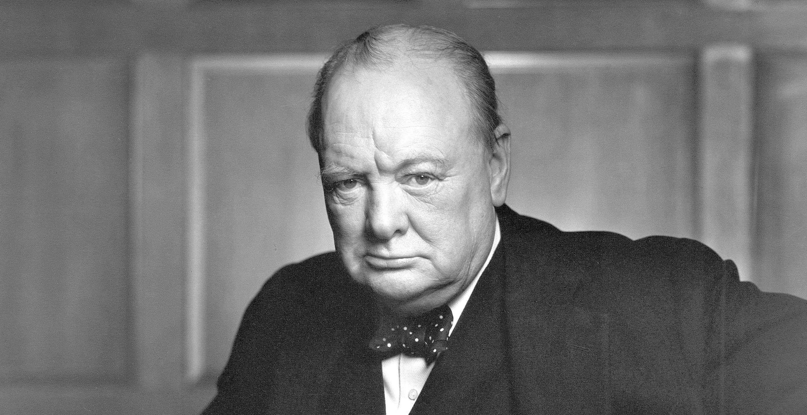

# Winston Churchill Biography

Sir Winston  Churchill (30 November 1874 – 24 January 1965) was a British politician and author, best known as Prime Minister of the United Kingdom during the Second World War.
Churchill was famous for his stubborn resistance to Hitler during the darkest hours of the Second World War.
Winston was born at Blenheim Palace, Woodstock near Oxford to an aristocratic family – the Duke of Marlborough. He was brought up by servants and friends of the family. He rarely spoke to his father, and he spent most of his childhood at boarding school – Harrow. Churchill wasn’t the best student, having a rebellious nature and was reportedly slow to learn; but Churchill excelled at sports and joined the officer cadet corps, which he enjoyed.
On leaving school, he went to Sandhurst to train as an officer. After gaining his commission, Churchill sought to gain as much active military experience as possible. He used his mother’s connections to get postings to areas of conflict. The young Churchill received postings to Cuba and North West India. He also combined his military duties with working as a war correspondent – earning substantial money for his reports on the fighting.
In 1899, he resigned from the military and pursued his career as a war correspondent. He was in South Africa for the Boer War, and he became a minor celebrity for his role in taking part in a scouting patrol, getting captured and later escaping. He might have gained the Victoria Cross for his efforts, though officially he was a civilian at the time. After this experience,  he gained a temporary commission in the South Africa Light Horses and later commented he had a ‘good war’ while continuing his work as a war correspondent.
Churchill returned to the UK in 1900 and successfully stood as a Conservative candidate for Oldham. After becoming an MP, Churchill began a lucrative speaking tour, where he could command a high price for his speeches.
In 1904, he made a dramatic shift, leaving the Conservative Party and joining the Liberal Party. He was later often called a ‘class traitor’ by some Conservative colleagues. Churchill disagreed with an increasing amount of Conservative policies, including tariff protection. Churchill also had some empathy for improving the welfare of the working class and helping the poor.
In the Liberal Party, Churchill made a meteoric political rise. By 1908, he was made President of the Board of Trade, and he was a key supporter of Lloyd George’s radical People’s Budget – a budget which saw the growth of an embryonic Welfare State and introduction of income tax to pay for it. The budget made a significant improvement to the life of the poor and helped to address the inequality of British society.
However, although Churchill was a Liberal, he was also staunchly anti-Socialist and suspicious of trade unions. During the General Strike,  he took a hardline stance to defeat the unions at any cost.
In 1911, he was made First Lord of the Admiralty – a post he held into the First World War.
On the outbreak of hostilities in Europe, Churchill was one of the most strident members of the cabinet arguing for British involvement in the war. In August 1914, the Liberal cabinet was split with some members against going to war on the continent. However, Churchill’s view prevailed, and he admitted to being enthused about the prospects of being involved in the ‘Great War’. He went to Belgium where he urged the Royal Marines to commit to action around Antwerp. This decision was criticised for wasting resources. Others said it helped saved the channel ports from the advancing German army.

